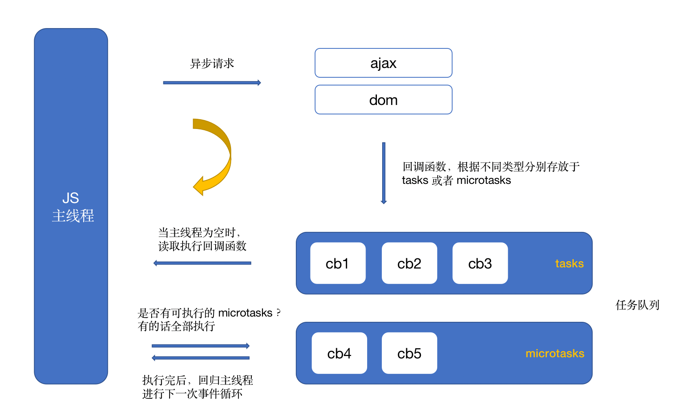
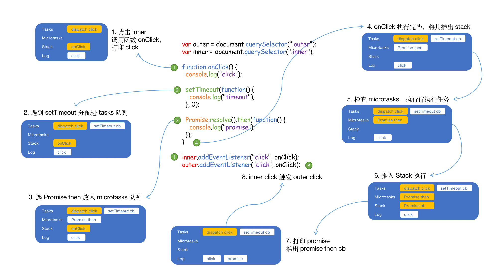
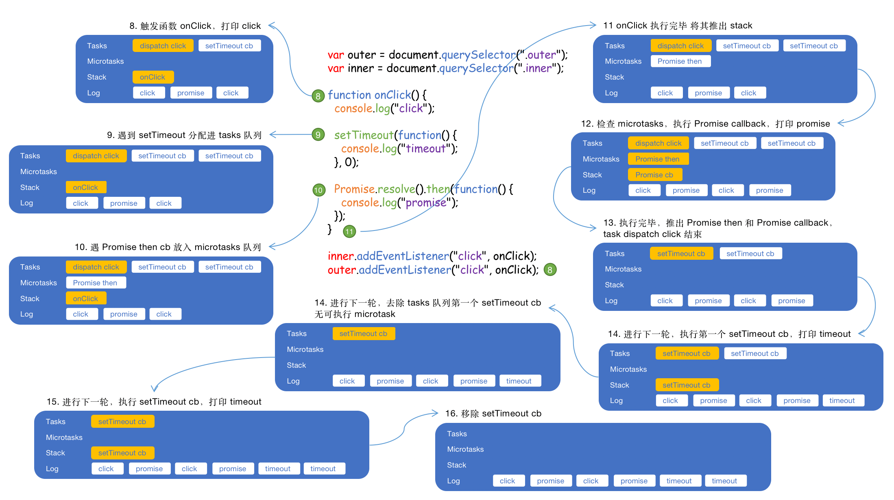
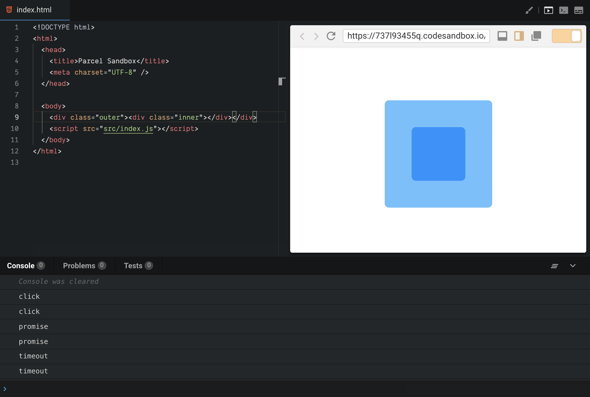
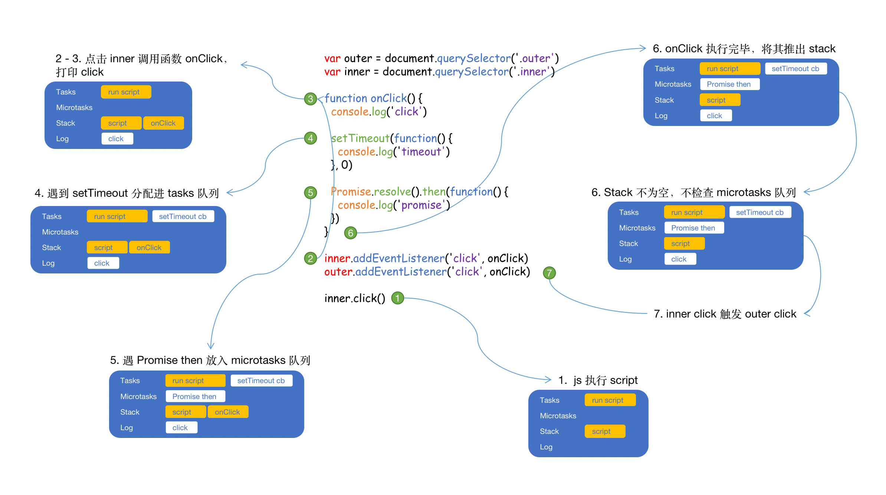
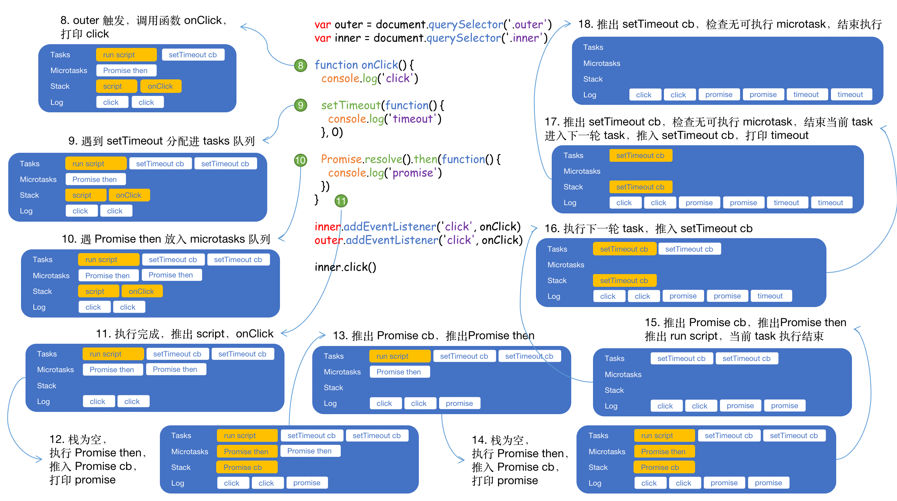

# JS 总结之 web 事件循环

众所周知，JavaScript 为了避免复杂，被设计成了单线程。

## ⛅️ 任务

单线程意味着所有任务都需要按顺序执行，如果某个任务执行非常耗时，线程就会被阻断，后面的任务需要等上一个任务执行完毕才会进行。而大多数非常耗时的任务是网络请求，CPU 是闲着的，所以为了资源的充分运用，便有了异步的概念。

异步便是把这些非常耗时的任务放到一边，其他任务先进行，等处理完其它不需要等待的任务再回头来计算刚刚被放一边的任务。这样就不会阻断线程啦。

就像上面讲述的，后面的任务需要等上一个任务执行完毕才会进行，叫**同步任务**；把这些非常耗时的任务放到一边，其他任务先进行，叫**异步任务**。

那么问题来了，**执行异步任务后会发生什么**？

## ☁️ 任务队列

在 stack 之外存在一个**任务队列**。

当异步任务执行完成后，会将一个回调函数（回调函数是在编写异步任务时指定的，用来处理异步的结果）推入**任务队列**，这些回调函数根据类放入到 **task** 和 **microtask** 中，最先被推入的函数先被推入 stack 执行，是先进先出的数据结构。由于有定时器这类功能， stack 一般要检查时间后，某些任务才会被执行。

## 🌧 事件循环

一旦 stack 没任务了，JavaScript 引擎就会去读取任务队列，这个过程会循环不断，被叫做事件循环。

用图表示：

## 🌩 setTimeout、setInterval

上文讲的定时功能，依靠 setTimeout、setInterval 提供的定时功能，区别在于 setTimeout 在指定时间后执行一次，而 setInterval 则重复执行。

setTimeout 在任务队列尾部添加了一个事件，在设定的时间后执行。但实际没有这么理想，当任务队列前面的任务非常耗时，回调函数不一定在设置的时间运行。

所以常见的写法 setTimeout(fn, 0)，是指定某个任务在 stack 最早可得的空闲时间执行，也就是说，尽可能早得执行。

(注意：HTML5 标准规定了 setTimeout 的第二个参数的最小值（最短间隔），不得低于 4 毫秒，如果低于这个值，就会自动增加。)

## ⛈ task 与 microtask

先看一个例子：

```js
console.log(1)

setTimeout(() => {
  console.log(2)
}, 0)

Promise.resolve()
  .then(() => {
    console.log(3)
  })
  .then(() => {
    console.log(4)
  })

console.log(5)
```

打印出来为：1，5，3，4，2。why? ☃️

### 🌱 初探

从上文知道，每个线程都有自己的事件循环，都是独立运行的。事件循环里面有 tasks 队列 和 mircotasks 队列，队列里面都按顺序存放着不同的待执行任务，这些任务从不同源划分的。

事件循环持续不断运行，按顺序执行 tasks 队列，在 tasks 之间，浏览器可以更新渲染。**只要 stack 为空，mircotasks 队列就会处理**，或者**在每个 task 的末尾处理**。在处理 mircotasks 队列期间，**新添加的 microtask 添加到队列的末尾并且也会被执行**。

### ☘ 源

一般来说，tasks 和 microtask 都有哪些：

task：

- DOM 操作任务：以非阻塞方式插入文档
- 用户交互任务：鼠标键盘事件、用户输入事件
- 网络任务
- IndexDB 数据库操作等 I/O
- setTimeout / setInterval
- history.back
- setImmediate（涉及 node，不在这里讨论，但归纳在这）

microtask：

- Promise.then
- MutationObserver
- Object.observe
- process.nextTick（涉及 node，不在这里讨论，但归纳在这）

> Jake Archibald 大大 说：setImmediate is task-queuing, whereas nextTick is before other pending work such as I/O, so it's closer to microtasks.

### 🍃 小试牛刀

分析一下上面的例子：

- Promise then 的回调被分到了 promises 队列中
- 当打印完 5 后，当前 script 已经执行完毕，开始按顺序执行 promises 队列中的回调， 打印了 3
- 接着遇到了下一个 Promise then 的回调，也会被执行，打印 4，至此，promises 队列已空，开始下一轮 task
- 执行下一个 task，打印 2

所以打印了 1，5，3，4，2

### 🍀 运行时机

tasks 按照顺序执行，浏览器可能在它们的间隔渲染视图。

Microtasks 也是按顺序执行的，执行的顺序，在下面两种情况下执行：

**1. 在 task 执行完之后执行。**

来看一个例子：

```js
var outer = document.querySelector('.outer')
var inner = document.querySelector('.inner')

function onClick() {
  console.log('click')

  setTimeout(function() {
    console.log('timeout')
  }, 0)

  Promise.resolve().then(function() {
    console.log('promise')
  })
}

inner.addEventListener('click', onClick)
outer.addEventListener('click', onClick)
```

**运行结果**：

[](https://codesandbox.io/s/8l70wz1ow0)

**截图**：



当点击 inner 后，console 打印：click，promise，click，promise，timeout，timeout。

**执行过程**：（用文字描述看不清楚，画了个图来一步一步根据）

触发 inner 点击之后：



触发 outer 点击之后：



**2. 当 stack 为空的时候，便执行完 microtask 队列里面的任务。**

可以在规范 [《html 规范: Cleaning up after a callback step 3》](https://html.spec.whatwg.org/multipage/webappapis.html#clean-up-after-running-a-callback) 中找到:

> If the JavaScript execution context stack is now empty, perform a microtask checkpoint.

我们把上面的例子改一下：

```js
var outer = document.querySelector('.outer')
var inner = document.querySelector('.inner')

function onClick() {
  console.log('click')

  setTimeout(function() {
    console.log('timeout')
  }, 0)

  Promise.resolve().then(function() {
    console.log('promise')
  })
}

inner.addEventListener('click', onClick)
outer.addEventListener('click', onClick)

inner.click()
```

加上 **inner.click()** 这句，情况变得不一样。

**运行结果**：

[](https://codesandbox.io/s/737l93455q)

**截图**：



当点击 inner 后，console 打印：click，click，promise，promise，timeout，timeout。

**执行过程**：（还是画图）

触发 inner 点击之后：



触发 outer 点击之后：



这个例子与上一个不同，当执行完第 6 步，并没有检查 microtasks 队列，因为 stack 并没为空，script 还在 stack 中。这也说明，上面的规则确保了 microtask 不打断当前代码执行。

联系[Tasks, microtasks, queues and schedules](https://jakearchibald.com/2015/tasks-microtasks-queues-and-schedules/) 文中的解释：

> ... The above rule ensures microtasks don't interrupt JavaScript that's mid-execution. This means we don't process the microtask queue between listener callbacks, they're processed after both listeners.

## 🚀 参考

- [HTML Living Standard: event-loops](https://html.spec.whatwg.org/multipage/webappapis.html#event-loops) by WHATWG
- [Tasks, microtasks, queues and schedules](https://jakearchibald.com/2015/tasks-microtasks-queues-and-schedules/) by Jake
- [深入探究 eventloop 与浏览器渲染的时序问题](https://github.com/jin5354/404forest/issues/61) by An Yan
- [JavaScript 运行机制详解：再谈 Event Loop](http://www.ruanyifeng.com/blog/2014/10/event-loop.html) by 阮一峰
- [这一次，彻底弄懂 JavaScript 执行机制](https://juejin.im/post/59e85eebf265da430d571f89) by ssssyoki
- [关于 task 和 microtask 的问答](https://www.zhihu.com/question/55364497/answer/144215284) by 顾轶灵
