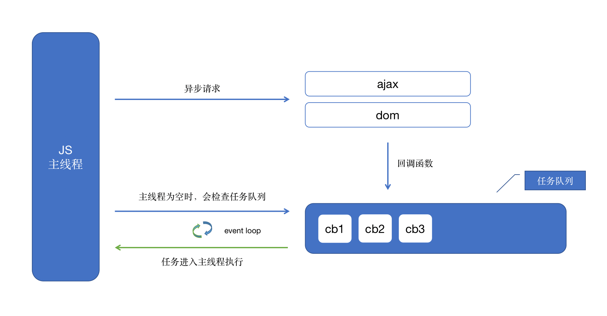

# JS 总结之异步

众所周知，JavaScript 为了避免复杂，被设计成了单线程。

## ⛅️ 任务

单线程意味着所有任务都需要按顺序执行，如果某个任务执行非常耗时，线程就会被阻断，后面的任务需要等上一个任务执行完毕才会进行。而大多数非常耗时的任务是网络请求，CPU 是闲着的，所以为了资源的充分运用，便有了异步的概念。

异步便是把这些非常耗时的任务放到一边，其他任务先进行，等处理完其它不需要等待的任务再回头来计算刚刚被放一边的任务。这样就不会阻断线程啦。

就像上面讲述的，后面的任务需要等上一个任务执行完毕才会进行，叫**同步任务**；把这些非常耗时的任务放到一边，其他任务先进行，叫**异步任务**。

那么问题来了，**执行异步任务后会发生什么**？

## ☁️ 任务队列

在主线程之外存在一个**任务队列**。

当异步任务执行完成后，会将一个回调函数（回调函数是在编写异步任务时指定的，用来处理异步的结果）推入**任务队列**，这些回调函数根据类型不同被分配到 **task** 和 **microtask** 中，最先被推入的函数先被推入主线程执行，是先进先出的数据结构。由于有定时器这类功能，主线程一般要检查时间后，某些任务才会被执行。

## 🌧 事件循环

一旦主线程没任务了，JavaScript 引擎就会去读取任务队列，这个过程会循环不断，被叫做事件循环。

用图表示：



## 🌩 setTimeout、setInterval

上文讲的定时功能，依靠 setTimeout、setInterval 提供的定时功能，区别在于 setTimeout 在指定时间后执行一次，而 setInterval 则重复执行。

setTimeout 在任务队列尾部添加了一个事件，在设定的时间后执行。但实际没有这么理想，当任务队列前面的任务非常耗时，回调函数不一定在设置的时间运行。

所以常见的写法 setTimeout(fn, 0)，是指定某个任务在主线程最早可得的空闲时间执行，也就是说，尽可能早得执行。

(注意：HTML5 标准规定了 setTimeout 的第二个参数的最小值（最短间隔），不得低于 4 毫秒，如果低于这个值，就会自动增加。)

## ⛈ microtask

JS 的事件循环执行时会区分 task 和 microtask，引擎在每个 task 执行完毕，从队列中取下一个 task 来执行之前，会先执行完所有 microtask 队列中的 microtask。

用图表示：


像整体代码 script，setTimeout，setInterval 这些会被分配到 task 中执行，而 process.nextTick、Promise 的 resolver、MutationObserver 的回调都会被分配到 microtask 中执行。

举个例子：

```js
console.log(1)

setTimeout(function st1() {
  console.log(2)
}, 0)

new Promise(solve => {
  console.log(3)
  solve(3)
}).then(function then1() {
  console.log(4)
  setTimeout(function st2() {
    console.log(5)
  }, 0)
})
```

第1轮：
1. 代码运行，打印 1
2. setTimeout 回调 st1 被分配到 task

| task | microtask |
| ---- | --------- |
| st1  |           |

3. 执行 new Promise，打印 3
4. 遇到 then 回调被分配到 microtask

| task | microtask |
| ---- | --------- |
| st1  | then1     |

5. 当前 task 执行完毕，执行microtask里的任务then1，打印 4，遇到 setTimeout 回调 st2 被分配到 task

| task | microtask |
| ---- | --------- |
| st1  |           |
| st2  |           |


第1轮执行完毕，打印：1，3，4

第2轮：
1. 检查 task，发生有 st1，打印2
2. 无microtask

第2轮执行完毕，打印：1，3，4，2


第3轮：
1. 检查 task，发生有 st2，打印5
2. 无microtask

第3轮执行完毕，打印：1，3，4，2，5

**为什么需要 microtask** ？根据 HTML Standard，在每个 task 运行完以后，UI 都会重渲染，那么在 microtask 中就完成数据更新，当前 task 结束就可以得到最新的 UI 了。反之如果新建一个 task 来做数据更新，那么渲染就会进行两次。

## 🚀 参考

- [JavaScript 运行机制详解：再谈 Event Loop](http://www.ruanyifeng.com/blog/2014/10/event-loop.html) by 阮一峰
- [这一次，彻底弄懂 JavaScript 执行机制](https://juejin.im/post/59e85eebf265da430d571f89) by ssssyoki
- [关于 task 和 microtask 的问答](https://www.zhihu.com/question/55364497/answer/144215284) by 顾轶灵
