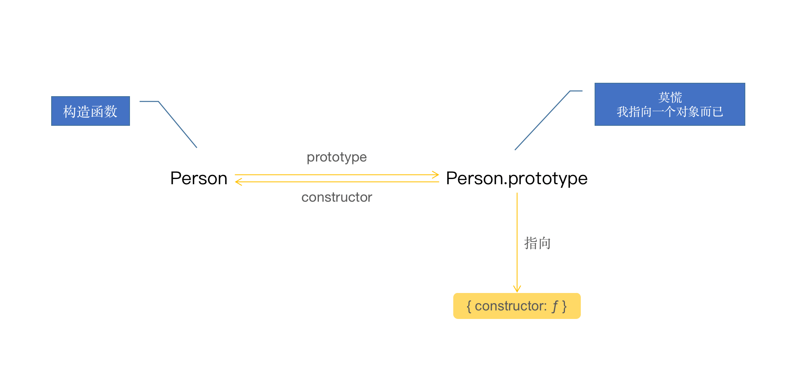
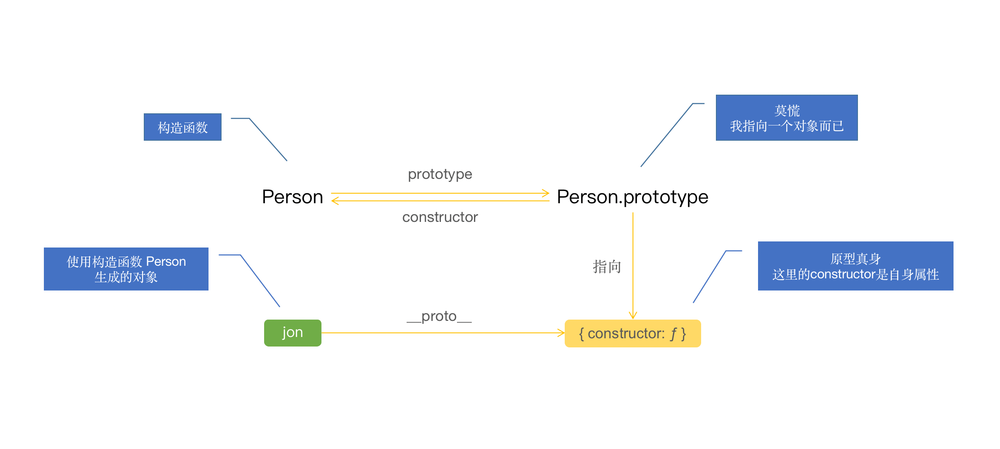

# 原型

在 JavaScript 中，函数也是属于对象，可以像其他对象一样访问属性，其中就有一个属性叫原型 prototype，值为一个对象。默认，该对象有一个 constructor 属性，指向了函数本身。

```JavaScript
function Person () {
  return 'hi'
}
Person.prototype // {constructor: ƒ}
Person.prototype.constructor // ƒ Person() {}
```
用图来表示：


我们可以对这个属性进行操作，但这个属性，只有在对函数进行构造调用的时候才会起作用


**🙂 为原型添加属性和方法**

```JavaScript
function Person (name) {
  this.name = name
}
Person.prototype.smart = true
Person.prototype.run = function () {
  console.log('running')
}

// 或者一次性添加

Person.prototype = {
  smart: true,
  run() {
    console.log('running')
  }
}
```

**😳 使用**

```JavaScript
// ...
let a = new Person('a')
a.name // a
a.smart // true
a.run() // running
```

**😍 hasOwnPrototype**

该方法来判断是否自身属性，如：

```JavaScript
function Person () {
  this.name = 'Jon'
}
Person.prototype.name = 'people'
Person.prototype.age = 18
let jon = new Person()
jon.hasOwnProperty('name') // true
jon.hasOwnProperty('age') // false
```

age 为原型上的属性，所以为 false

**😟 isPrototypeOf**

该方法来判断对象是否是另一个对象的原型，如：

```JavaScript
let base = {
  name: 'people',
  age: 18
}
function Person () {
  this.name = 'Jon'
}
Person.prototype = base
let jon = new Person()
base.isPrototypeOf(jon) // true
```

**😯 getPrototypeOf**

当不知道对象的原型具体是哪个的时候，可以使用该方法来判断，如：

```JavaScript
let base = {
  name: 'people',
  age: 18
}
function Person () {
  this.name = 'Jon'
}
Person.prototype = base
let jon = new Person()
Object.getPrototypeOf(jon) // { name: 'people', age: 18 }
```

**🙃 \_ \_proto\_ \_**

每个对象都有一个该属性，便携访问原型对象，直指原型对象：

```JavaScript
let base = {
  name: 'people',
  age: 18
}
function Person () {
  this.name = 'Jon'
}
Person.prototype = base
let jon = new Person()
jon.__proto__ // { name: 'people', age: 18 }
```

用图来表示：


与 prototype 不同的是，**\_ \_proto\_ \_** 是对象的属性，prototype 是构造函数的属性


**原型链**

当访问对象的一个属性时，js 引擎会遍历自身对象的属性，如果找不到，便会去**原型**上查找该属性，如果还是找不到，便会继续往上找，由于**原型是一个对象**，是对象便会有一个原型，有原型说明存在构造函数，如 Person 例子，查看原型的构造函数是啥：

```JavaScript
// ...
Person.prototype.__proto__.constructor // 原型的原型的构造函数, ƒ Object() { [native code] }
```

用图表示就是


```JavaScript
// ...
let a = new Person('a')
a.toString() // "[object Object]"
```

Person 函数和原型上都没有 toString 方法，所以只能调用 Object 上的 toString 方法。

注意：基于同一个构造函数生成的对象，共享函数的原型，如：

```JavaScript
// ...
let b = new Person('b')
b.name // b
b.smart = false
b.smart // false
a.smart // false
```

对 b 的 smart 属性进行修改，a 访问 smart 也有原先的 true 变为 false 了。

如果自身和原型上存在同名属性，会优先使用自身属性，例如：

```JavaScript
function Person () {
  this.name = 'Jon'
}
Person.prototype.name = 'people'
let jon = new Person()
jon.name // Jon
```

## ❄️ 总结自：

- 《JavaScript 面向对象编程指南（第 2 版）》第 5 章 原型
- 《Node.js 开发指南》附录 A
